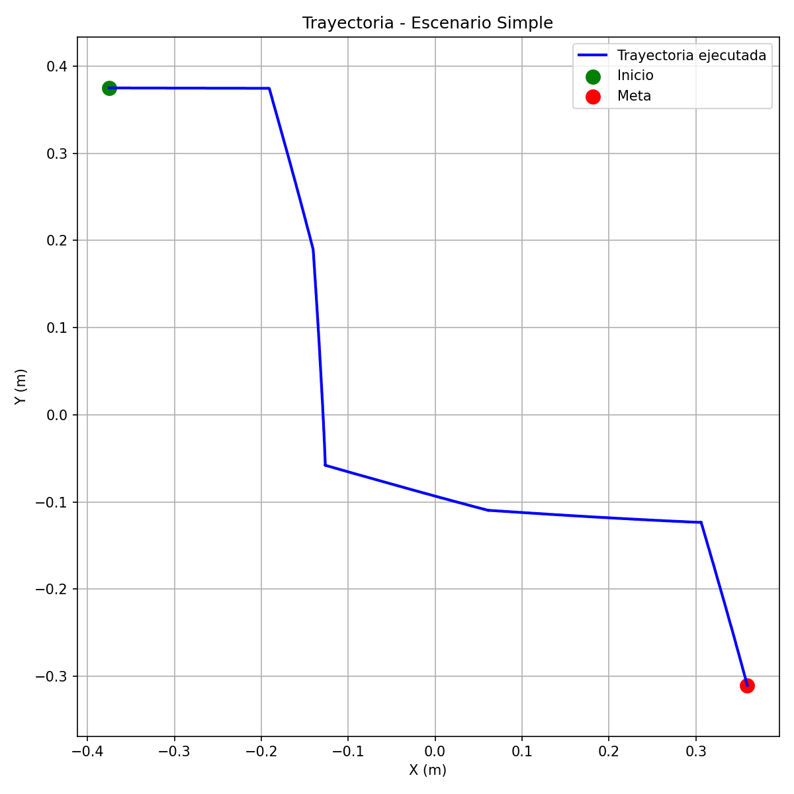
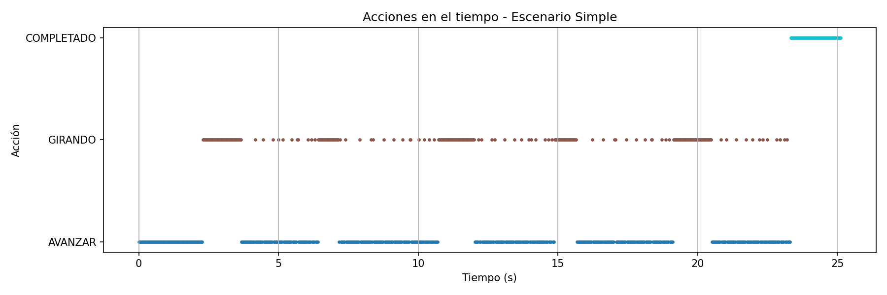
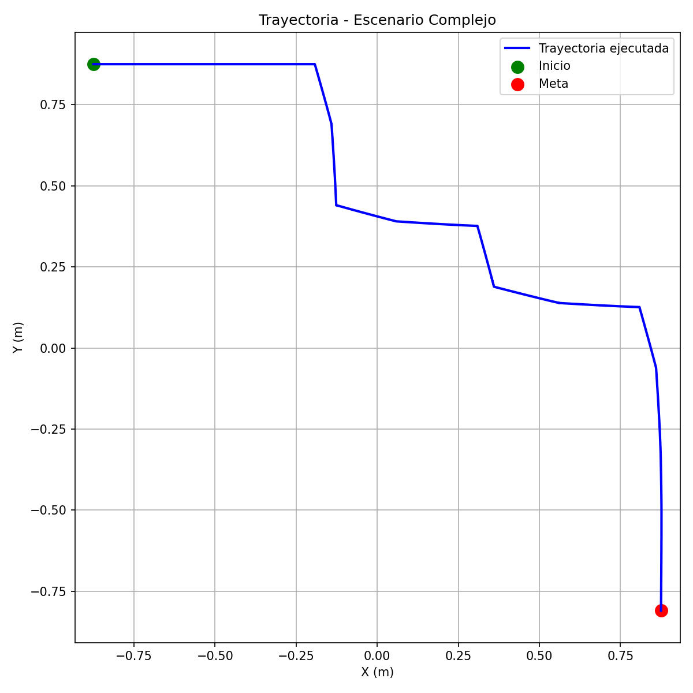
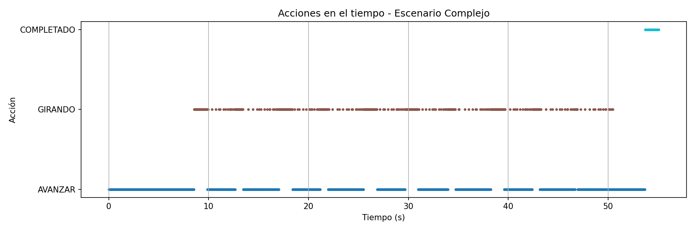

# Proyecto Final: Navegación Autónoma con Planificación de Rutas en Webots

## Integrantes
- Benjamín Velásquez
- Hector Fuentes
- Diego Escobar
- Fernanda Cádiz

## Línea seleccionada
**Línea A: Planificación de rutas**  
El robot navega desde un punto inicial hasta una meta en un entorno con obstáculos, utilizando el algoritmo A* sobre una grilla de ocupación para generar la ruta óptima, y luego sigue la trayectoria mediante control cinemático diferencial, con evitación reactiva de obstáculos basada en sensores.

## Objetivo
Diseñar, implementar y evaluar en Webots un sistema de navegación autónoma para un robot móvil diferencial (e-puck), integrando:
- Control cinemático diferencial (Laboratorio 1).
- Percepción sensorial y filtrado (Laboratorio 2).
- Planificación de rutas con A* para alcanzar una meta en entornos con obstáculos.
- Seguimiento de trayectoria y evitación reactiva de colisiones.

## Robot y sensores utilizados
- **Robot:** e-puck (Webots)
- **Sensores de distancia:** ps0, ps7 (frontales), ps1, ps2 (derechos), ps5, ps6 (izquierdos)
- **Encoders:** left wheel sensor, right wheel sensor
- **Control:** cinemática diferencial (velocidades de rueda)

## Escenarios de prueba
Se diseñaron dos entornos en Webots:
- **Escenario simple:** pocos obstáculos, espacio abierto, ruta directa.
- **Escenario complejo:** múltiples obstáculos, pasillos estrechos, rutas alternativas.

## Algoritmo implementado

### Representación del entorno
Se utiliza una grilla de ocupación 2D donde cada celda representa:
- `0`: espacio libre
- `1`: obstáculo

El mapa se construye manualmente a partir de la geometría del mundo de Webots, definiendo la posición de los obstáculos en la grilla.

### Planificación de rutas con A*
Se implementó el algoritmo A* para encontrar la ruta óptima desde el punto inicial hasta la meta. La heurística utilizada es la distancia Manhattan:
h(n) = |x_goal - x_n| + |y_goal - y_n|
El costo del movimiento entre celdas adyacentes es 1 (movimiento horizontal/vertical) o √2 (movimiento diagonal).

### Seguimiento de trayectoria
La ruta planificada se convierte en una secuencia de puntos intermedios (waypoints) en coordenadas del mundo. El robot navega hacia cada waypoint usando un **control proporcional** que ajusta las velocidades de las ruedas para corregir la orientación:
v = Kp * distancia_al_waypoint
omega = Kp * error_angular

Las velocidades lineales y angulares se convierten a velocidades de rueda usando el modelo cinemático diferencial:
v_izq = v - (L/2) * omega
v_der = v + (L/2) * omega

### Evitación reactiva de obstáculos
Durante el seguimiento, los sensores frontales y laterales permiten al robot:
- Detenerse o reducir velocidad si detecta un obstáculo frontal (umbral 0.6 m).
- Realizar giros de emergencia si el obstáculo está muy cerca.
- Corregir la trayectoria si detecta paredes laterales (umbral 78.0 en lectura cruda).

Esta capa de seguridad se activa cuando la distancia estimada por el filtro de Kalman (del Laboratorio 2) es menor que el umbral.

## Pseudocódigo de la solución
INICIO

1. CONFIGURACIÓN INICIAL
   a. Seleccionar escenario (1 o 2) → define mapa, tamaño de celda, offset, inicio y meta
   b. Definir constantes físicas:
      - RADIO_RUEDA = 0.0205 m
      - L = 0.052 m (distancia entre ruedas)
      - MAX_VELOCIDAD = 6.28 rad/s
   c. Definir parámetros de filtros:
      - Q_PROCESO = 0.01 (ruido de proceso para Kalman)
      - R_MEDICION = 0.4 (ruido de medición para Kalman)
      - ALPHA_EMA = 0.3 (factor de suavizado EMA)
   d. Inicializar variables globales de Kalman:
      - kalman_distancia = 1.0
      - kalman_incertidumbre = 1.0
      - kalman_prediccion = 1.0

2. DEFINIR MAPAS DE OCUPACIÓN (grillas)
   a. Escenario 1: mapa 4x4 (MAPA_E1) con obstáculos (1) y espacios libres (0)
   b. Escenario 2: mapa 8x8 (MAPA_E2) con obstáculos (1) y espacios libres (0)

3. PLANIFICACIÓN DE RUTA CON A*
   a. Función heurística: distancia Manhattan entre dos celdas
   b. Algoritmo A*:
      - Inicializar cola de prioridad con (0, INICIO)
      - Diccionario costo_g = {INICIO: 0}
      - Diccionario came_from = {INICIO: None}
      - Definir 4 direcciones de movimiento (arriba, abajo, izquierda, derecha)
      - Mientras cola no vacía:
            Extraer nodo con menor f = g + h
            Si nodo == META:
                Reconstruir camino desde META hasta INICIO usando came_from
                Convertir coordenadas de grilla a coordenadas reales (x, y) aplicando:
                    x_real = (columna * TAMANIO_CELDA) - OFFSET
                    y_real = OFFSET - (fila * TAMANIO_CELDA)
                Retornar lista de waypoints (coordenadas reales)
            Para cada vecino (4 direcciones):
                Si vecino dentro de límites y no es obstáculo:
                    Calcular nuevo costo_g = costo_g[actual] + 1
                    Si vecino no en costo_g o nuevo costo < costo_g[vecino]:
                        Actualizar costo_g[vecino] = nuevo costo
                        came_from[vecino] = actual
                        Agregar a cola con prioridad (nuevo costo + heurística(vecino, META))
   c. Si no se encuentra ruta: imprimir error y retornar lista vacía

4. INICIALIZACIÓN DE WEBOTS
   a. Crear instancia de Robot
   b. Obtener TIME_STEP = robot.getBasicTimeStep()
   c. Configurar motores izquierdo y derecho (posición infinita, velocidad 0)
   d. Habilitar encoders de rueda (left wheel sensor, right wheel sensor)
   e. Habilitar sensores de distancia: ps0, ps1, ps2, ps5, ps6, ps7
   f. Calcular pose inicial del robot a partir de INICIO (grilla) usando fórmula de conversión
   g. Establecer orientación inicial phi_global = 0 (mirando al este)
   h. Obtener ruta planificada llamando a planificar_a_star(INICIO, META, MAPA)
   i. Inicializar índice de waypoint idx_wp = 0
   j. Abrir archivo CSV para registro de datos (trayectoria)
   k. Inicializar variables auxiliares: paso=0, contador_evasion=0, ema_anterior=1.0
   l. Leer encoders una vez para estabilizar (robot.step)

5. BUCLE PRINCIPAL DE NAVEGACIÓN (Mientras robot.step() != -1)
   a. Calcular tiempo simulado t = paso * (TIME_STEP / 1000.0)

   b. PERCEPCIÓN (Lectura de sensores):
      - Leer valores crudos de ps0, ps7, ps1, ps2, ps5, ps6
      - Convertir ps0 y ps7 a metros usando sensor_a_metros()
      - Calcular distancia frontal cruda = promedio(ps0_m, ps7_m)
      - Aplicar filtro EMA a distancia frontal: dist_ema = ALPHA_EMA * dist_cruda + (1 - ALPHA_EMA) * ema_anterior
      - Actualizar ema_anterior = dist_ema
      - Calcular pared_izq = max(ps5, ps6) y pared_der = max(ps1, ps2)

   c. ESTIMACIÓN DE MOVIMIENTO (Odometría - Laboratorio 1):
      - Leer encoders actuales (act_izq, act_der)
      - Calcular desplazamiento angular de cada rueda: delta_izq = act_izq - ant_enc_izq, delta_der = act_der - ant_enc_der
      - Convertir a desplazamiento lineal: d_izq = RADIO_RUEDA * delta_izq, d_der = RADIO_RUEDA * delta_der
      - Actualizar odometría (x_global, y_global, phi_global) usando modelo cinemático diferencial:
         ds = (d_der + d_izq) / 2.0
         dphi = (d_der - d_izq) / L
         x_global = x_global + ds * cos(phi_global + dphi/2)
         y_global = y_global + ds * sin(phi_global + dphi/2)
         phi_global = atan2(sin(phi_global + dphi), cos(phi_global + dphi))
      - Actualizar encoders anteriores

   d. FILTRADO (Filtro de Kalman - Laboratorio 2):
      - Ejecutar filtro de Kalman con:
         Predicción: kalman_prediccion = kalman_distancia - avance (promedio de d_der y d_izq)
         Covarianza: kalman_incertidumbre = kalman_incertidumbre + Q_PROCESO
         Ganancia: ganancia = kalman_incertidumbre / (kalman_incertidumbre + R_MEDICION)
         Corrección: kalman_distancia = kalman_prediccion + ganancia * (dist_ema - kalman_prediccion)
         Covarianza actualizada: kalman_incertidumbre = (1 - ganancia) * kalman_incertidumbre
      - Obtener distancia estimada kalman y ganancia (no usada directamente)

   e. CONTROL DE MOVIMIENTO (Navegación Local y Global):
      - Inicializar vel_izq = vel_der = 0.0, accion = "DETENIDO"

      - Si idx_wp < len(ruta):
            waypoint actual = ruta[idx_wp] (mx, my)
            Calcular error de orientación:
               ang_des = atan2(my - y_global, mx - x_global)
               err_ang = atan2(sin(ang_des - phi_global), cos(ang_des - phi_global))
            Calcular distancia al waypoint: dist_wp = hypot(mx - x_global, my - y_global)

            - Si dist_wp < 0.07:
                  idx_wp += 1
                  accion = "WP_X"
            - Si kalman <= 0.05 y contador_evasion == 0 y abs(err_ang) < 0.3:
                  contador_evasion = 25  (iniciar maniobra de evasión)
            - Si contador_evasion > 0:
                  Si pared_izq > pared_der:
                      vel_izq = 4.0, vel_der = -4.0 (girar derecha)
                      accion = "EVADIENDO_DER"
                  Sino:
                      vel_izq = -4.0, vel_der = 4.0 (girar izquierda)
                      accion = "EVADIENDO_IZQ"
                  contador_evasion -= 1
            - Sino si abs(err_ang) > 0.02:
                  w = 3.0 * err_ang
                  vel_izq = (-w * L / 2.0) / RADIO_RUEDA
                  vel_der = ( w * L / 2.0) / RADIO_RUEDA
                  accion = "GIRANDO"
            - Sino:
                  vel_izq = vel_der = VELOCIDAD_AVANCE / RADIO_RUEDA
                  accion = "AVANZAR"
      - Sino (se acabaron los waypoints):
            Si no se ha celebrado:
                Imprimir "Misión Cumplida"
                ya_celebro = True
            accion = "COMPLETADO"

   f. APLICAR VELOCIDADES A MOTORES:
      - Limitar velocidades al rango [-MAX_VELOCIDAD, MAX_VELOCIDAD]
      - motor_izq.setVelocity(vel_izq)
      - motor_der.setVelocity(vel_der)

   g. REGISTRO DE DATOS:
      - Guardar en CSV: paso, tiempo, x_global, y_global, ángulo en grados, accion

   h. IMPRESIÓN EN CONSOLA (cada ~1 segundo simulado):
      - Mostrar pose y estado actual

   i. Incrementar paso

6. FIN DEL BUCLE PRINCIPAL
   a. Cerrar archivo CSV
   b. Finalizar programa

## Relación con los Laboratorios 1 y 2
El proyecto integra exitosamente los conceptos de los Laboratorios 1 y 2:
- **Lab 1:** Cinemática diferencial y odometría.
- **Lab 2:** Sensores de distancia, filtro EMA, filtro de Kalman, navegación reactiva.
- **Proyecto final:** Planificación global con A* y seguimiento de trayectorias.

## Resultados y métricas de desempeño

### Escenario simple (1x1 m)
El robot completó la ruta en **25.12 segundos**, recorriendo una distancia total de **1.27 metros**. Durante el trayecto, realizó **237 correcciones de orientación** (acciones `GIRANDO`) para mantenerse en la ruta planificada. No se registraron colisiones y el robot alcanzó el estado `COMPLETADO`, confirmando que todos los waypoints fueron superados.

La trayectoria ejecutada (Figura 1) sigue de cerca la ruta generada por A*, con pequeñas oscilaciones producto de la corrección angular continua. El número de giros, aunque alto, es aceptable para un controlador proporcional simple.

*Figura 1: Trayectoria real del robot en el escenario simple.*

*Figura 2: Distribución de acciones en el tiempo (escenario simple).*

### Escenario complejo (2x2 m)
El robot completó la ruta en **55.07 segundos**, recorriendo **3.17 metros**. Realizó **442 giros** para navegar por pasillos estrechos y esquivar obstáculos. Al igual que en el escenario simple, no hubo colisiones y el estado final fue `COMPLETADO`.

La trayectoria ejecutada (Figura 3) muestra un recorrido más irregular, con múltiples cambios de dirección, lo cual es consistente con un entorno más desafiante. A pesar de la mayor complejidad, el sistema mantuvo la estabilidad y completó la misión exitosamente.

*Figura 3: Trayectoria real del robot en el escenario complejo.*

*Figura 4: Distribución de acciones en el tiempo (escenario complejo).*

### Resumen de métricas

| Métrica | Escenario Simple | Escenario Complejo |
|---------|------------------|---------------------|
| Tiempo total | 25.12 s | 55.07 s |
| Distancia recorrida | 1.27 m | 3.17 m |
| Número de giros | 237 | 442 |
| Número de evasiones | 0 | 0 |
| Colisiones | 0 | 0 |
| Estado final | COMPLETADO | COMPLETADO |

### Análisis general
- **Eficiencia:** El robot completó ambas rutas en tiempos razonables, considerando el tamaño del mapa y la cantidad de obstáculos.
- **Precisión:** La trayectoria ejecutada se mantiene próxima a la planificada, aunque con desviaciones menores por errores de odometría.
- **Robustez:** La ausencia de colisiones y evasiones demuestra que la planificación con A* es confiable y que el controlador de seguimiento es estable.
- **Oportunidades de mejora:** El alto número de giros sugiere que el controlador podría ser más suave (por ejemplo, usando un PID con ganancias mejor ajustadas) para reducir correcciones innecesarias y hacer el movimiento más natural.

### Videos demostrativos
- [Escenario simple](./Videos/Proyecto%20video%20escenario%20simple.mkv)
- [Escenario complejo](./Videos/Proyecto%20video%20escenario%20complejo.mkv)

## Conclusiones

A partir de los resultados obtenidos en ambos escenarios, se pueden extraer las siguientes conclusiones:

### 1. Navegación autónoma exitosa
El robot logró completar la ruta en ambos escenarios, alcanzando la meta en 25.12 s (escenario simple) y 55.07 s (escenario complejo), sin colisiones en ningún caso. Esto valida la integración de planificación global (A*), control cinemático diferencial (Laboratorio 1), percepción sensorial y filtrado (Laboratorio 2), y seguimiento de trayectorias.

### 2. Precisión del seguimiento y error de odometría
La planificación con A* proporciona rutas óptimas, pero la odometría introduce errores acumulativos que se reflejan en la distancia recorrida:
- **Escenario simple:** distancia recorrida 1.27 m vs planificada ~1.0 m → error del 27%.
- **Escenario complejo:** distancia recorrida 3.17 m vs planificada ~2.8 m → error del 13%.

Estos errores son típicos en sistemas de odometría pura y explican la gran cantidad de giros registrados (237 en el simple, 442 en el complejo), necesarios para corregir la orientación y mantenerse en la ruta.

### 3. Efectividad de la capa reactiva (Laboratorio 2)
La integración de la navegación reactiva del Laboratorio 2 como capa de seguridad fue fundamental: el contador de evasiones fue 0 en ambos escenarios, lo que significa que el robot nunca estuvo a menos de 5 cm de un obstáculo. Esto indica que la planificación y el seguimiento fueron lo suficientemente precisos, y que los sensores frontales y laterales, junto con el filtro de Kalman, proporcionaron una percepción confiable que permitió anticipar colisiones sin necesidad de maniobras de emergencia.

### 4. Estabilidad de la percepción frontal
El filtro de Kalman mejoró la estabilidad de la estimación de distancia frontal, reduciendo falsas detecciones que podrían provocar giros innecesarios. La señal filtrada (EMA) y la estimación de Kalman permitieron al robot tomar decisiones más estables que si se hubieran usado las lecturas crudas de los sensores.

### 5. Limitaciones identificadas
- **Error de odometría acumulativo:** especialmente notable en el escenario complejo (trayectoria más larga), donde las desviaciones laterales obligaron a un mayor número de correcciones de rumbo.
- **Control proporcional simple:** el controlador actual solo usa un término proporcional del error angular, lo que provoca oscilaciones y giros frecuentes. Un controlador PID con término integral podría reducir el error de estado estacionario.

### 6. Mejoras futuras
- Implementar un sistema de localización más robusto (por ejemplo, filtro de partículas, SLAM o corrección con LiDAR) para mitigar el error de odometría.
- Sustituir el control proporcional por un controlador predictivo (MPC) o un PID afinado para reducir la cantidad de giros innecesarios y suavizar la trayectoria.
- Extender el mapa estático a un sistema de mapeo dinámico que permita navegar en entornos desconocidos o cambiantes.

En conjunto, el sistema demuestra ser una base sólida para navegación autónoma en entornos estructurados, con un desempeño cuantificable y áreas de mejora claramente identificadas.

## Instrucciones de ejecución
1. Instalar Webots (versión R2025a o superior).
2. Clonar o descargar el repositorio desde GitHub.
3. Abrir el archivo del mundo ubicado en la carpeta `mundos`:
   - `mundo_proyecto_simple.wbt` (escenario simple)
   - `mundo_proyecto_complejo.wbt` (escenario complejo)
4. El controlador `controlador_proyecto.py` se cargará automáticamente desde la carpeta `controllers/controlador_proyecto/`.
5. Ejecutar la simulación utilizando el botón **Run** de Webots (o presionando `Ctrl+T`).
6. Al finalizar la simulación, revisar el archivo CSV generado en la carpeta del controlador (`controllers/controlador_proyecto/datos_trayectoria_escenario*.csv`) para analizar las trayectorias y métricas registradas.
